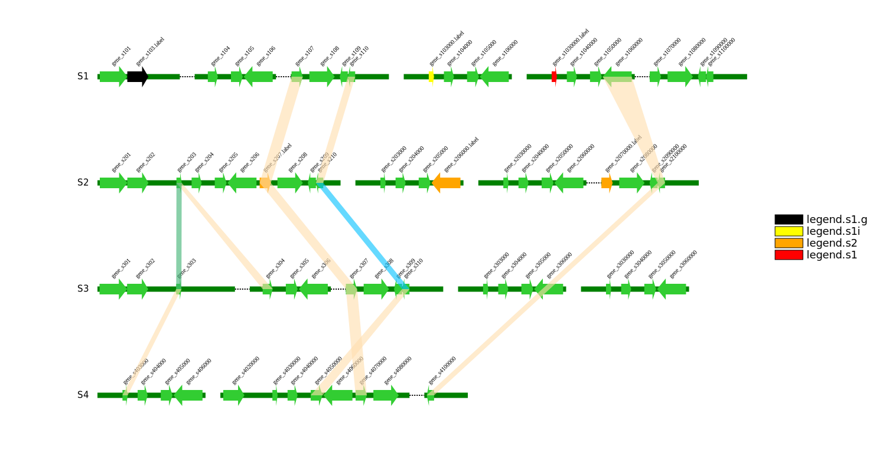
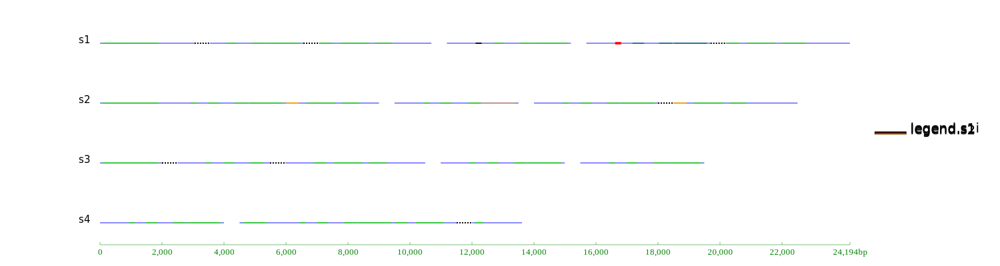
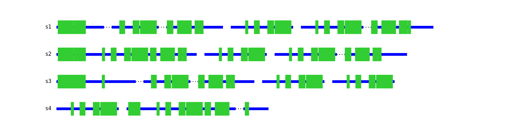
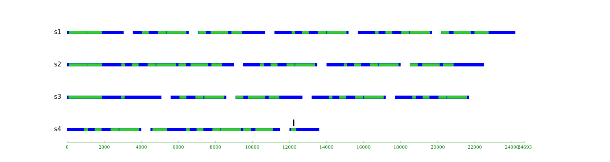
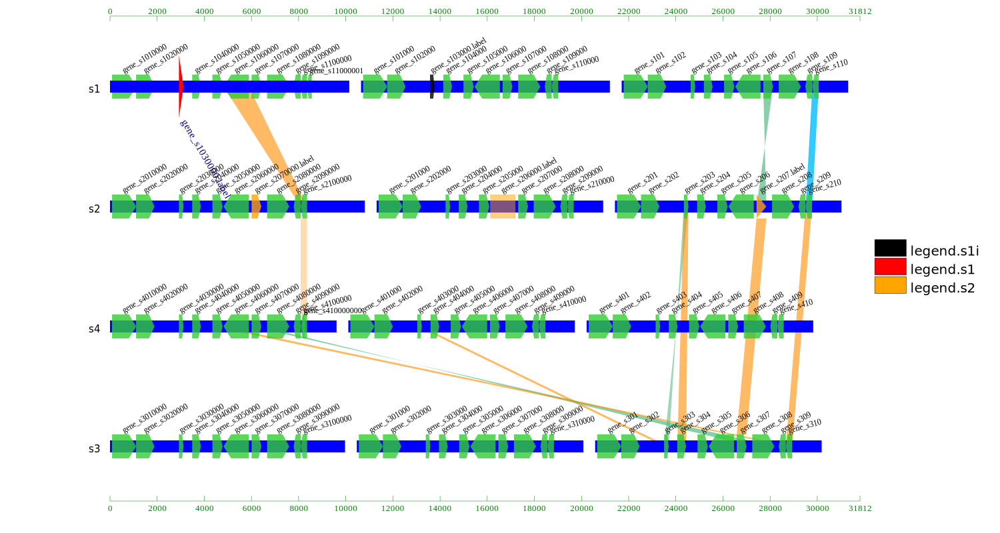

# ClustersPloter
#### install:<br>
```
git clone
```

#### usage:<br>
```
  cd  example 
  cat test.sh 
```
&nbsp;&nbsp;&nbsp;&nbsp;plot gene clusters of many samples, one track means one sample, one track contain more than one fragments. one fragment contain gene cluster. you can defined every gene or feature(rotation,color,label,order depth,font size) in clusters. And add crossing link for any pair of genes.<br>

#### main feature:<br>
- every track mean one sample , one sample can has more than one fragments. you can defind the feature color/lable font size/label color/label rotaion in feature.color.label.conf <br>
- you can draw crosslink or sysnteny among features of different tracks<br>

#### update feture:<br>
&nbsp;&nbsp;**2018-10-29**:<br>
&nbsp;&nbsp;&nbsp;&nbsp;1. redesign the the main.conf and feature.crossing.link.conf to make more freely to reset every feature, reset every link color and opacity one by one, and reset order depth of every feature or crosslink or track, reset feature height one by one as in out2.svg<br>
&nbsp;&nbsp;&nbsp;&nbsp;2. add rect for feature shape, now have arrow and rect, you can use arrow and rect at the same time<br>
&nbsp;&nbsp;&nbsp;&nbsp;3. remove the legend border line<br>

#### bug:<br>
&nbsp;&nbsp;&nbsp;&nbsp; welcome to call me at the issue<br>

#### todo:<br>
&nbsp;&nbsp;**2018-10-29**:<br>
&nbsp;&nbsp;&nbsp;&nbsp;1. plot tracks by sort sample list, or you can adjust the track order by adjust list file <br>
&nbsp;&nbsp;&nbsp;&nbsp;3. sort by feature,so same feature of different tracks can align centre<br>
&nbsp;&nbsp;&nbsp;&nbsp;4. add ratio scale in the bottom to recognise the approximate length of every feature <br> <br> 



<br><br><br>

<br><br><br>

<br><br>

<br><br><br>

<br><br><br>


contact:<br>
&nbsp;&nbsp;&nbsp;&nbsp;QQ: 1522051171<br>
&nbsp;&nbsp;&nbsp;&nbsp;mail: ilikeorangeapple@gmail.com
