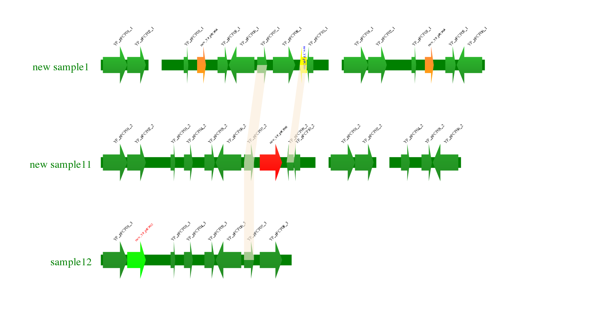

# ClustersPloter
install: 
    way1: git clone

feature: 
    1. 每行是一个样品，一个样品可以画多段fragment，fragment里面的每个feature的颜色和label的文字/颜色/旋转角度都可以调节在feature.color.label.conf里面
    2. 相邻行或者跨行之间的feature可以画共线性link

bug: 
    1. 图例里面的文字可能会溢出，不过可以通过调节main.conf里面的参数fix

todo: 
    1. 增加按照样品名重新排序，现在默认是按照list里面的样品顺序。
    2. feature目前只有arrow一种类型，待增加
usage: 1.plot gene clusters of many samples, one track means one sample, one track contain more than one fragments. one fragment contain gene cluster. you can defined every gene(color,label,font size) in clusters. And add crossing link for any pair of genes.
    
    

contact: 
    QQ: 1522051171
