# ClustersPloter
### Usage:<br>
```
%  git clone http://github.com/orangeSi/ClustersPloter.git
%  cd  ClustersPloter/example/
%  cat work.sh # output svg and html
#  or go to https://github.com/orangeSi/ClustersPloter/wiki or https://clustersploter.readthedocs.io/en/latest/# 
```

<br><br>

<br><br>

### Dependence<br>
```
#method1: install by docker

#method2: manually install, tested only in Centos yet
* perl >=v5.10.1
optional:
  samtools >=1.7 # if you give sam or bam file, add this to linux PATH 
  Imager::Font  # perl package for cacualte text height/width by font size 
```

### Features:<br>
- plot gene clusters of many samples, one track means one sample, one track contain more than one fragments. one fragment contain gene cluster. you can defined every gene or feature(rotation,color,label,order depth,font size) in clusters. And add crossing link for any pair of genes.<br>
- every track mean one sample , one sample can has more than one fragments. you can defind the feature color/lable font size/label color/label rotaion in feature.color.label.conf <br>
- you can draw crosslink or sysnteny among features of different tracks or same track<br>
- illunimate pair-end or mate-pair reads or pacbio/nanopore long reads mapping with varation(indel, sv) in bam, support snpindel in vcf file, not support complex sv yet<br>

### Update:<br>
- support gff/bed in main.conf(instead of track.list)
- support GC plot 
- support directly modify almost features attribution in html with mouse-click (color, opacity, postion, font_size)
- support minimap2/blast/Mummer and commom alignment format for synteny
- support both reverse fragment and reverse alignment hit in synteny
#### 2018-12-28:<br>
- add html format output, so you can pan or zoom the svg in html<br>
#### 2018-12-21:<br>
- add synteny between genomes, only support paf(like minimap2 ouput) format yet. example is out8 in example/work.sh<br>
#### 2018-12-20:<br>
- support indel of cigar or indel in vcf now, but not support snp yet. test is out3 in example/work.sh<br>
#### 2018-12-10:<br>
- add  plot depth and pabio read mapping of bam file, as out3 in example/work.sh , inspired by  https://github.com/nspies/genomeview <br>
#### 2018-11-12:<br>
- rewrite feature.crossing.link.conf so that defined color and opactity or order or anchor position of every pair of links.<br>
- add tracks_reorder to plot tracks by new order, otherwise you must adjust --list file <br>
#### 2018-11-07:<br>
- feature_shaple now support <b>circle_point</b>/rect/arrow, add <b>feature_shift_y</b>, as example/out10.svg. combine with <b>feature_height_ratio</b> or <b>feature_shift_y</b>, try to plot <b>line</b> or <b>scatter</b> or <b>heatmap</b> or <b>histogram</b> is possible but hard for much data points, I will try do this by embed svg in svg, the embedded svg is producted by python or R tool(such as https://github.com/nspies/genomeview or https://github.com/svviz/svviz), and the linux convert not support embed svg, but cairosvg support it (should use the absoluted embedded svg path)!<br>
#### 2018-10-29:<br>
- redesign the the main.conf and feature.crossing.link.conf to make more freely to reset every feature, reset every link color and opacity one by one, and reset order depth of every feature or crosslink or track, reset feature height one by one as in out2.svg<br>
- add rect for feature shape, now have arrow and rect, you can use arrow and rect at the same time<br>
- remove the legend border line<br>
<br>

#### Tips:<br>
```
$samtools calmd or SamFixCigar.jar of jvarkit will convert M to X/= in cigar of sam file, if do this, will see snp of reads in read_mapping
```

#### ToDo:<br>
&nbsp;&nbsp;&nbsp;&nbsp; add gff/bed to reads_mapping
&nbsp;&nbsp;&nbsp;&nbsp; add reads alignment start/end for reads_mapping, only have target alignment start/end yet
&nbsp;&nbsp;&nbsp;&nbsp; support Hi-C data/reads mapping
&nbsp;&nbsp;&nbsp;&nbsp; support julia/python api to call clustersploter
&nbsp;&nbsp;**2018-12-28**:<br>
&nbsp;&nbsp;&nbsp;&nbsp;1. add gtf fomrat, not only gff format<br>
&nbsp;&nbsp;&nbsp;&nbsp;2. add blat_spl and mummer4 fomrat, not only blast_m8 or paf format<br>
&nbsp;&nbsp;**2018-11-09**:<br>
&nbsp;&nbsp;&nbsp;&nbsp;1. sort by feature,so same feature of different tracks can align centre<br>
&nbsp;&nbsp;&nbsp;&nbsp;2. add ratio scale in the bottom to recognise the approximate length of every feature <br>


```
cat example/work.sh
```
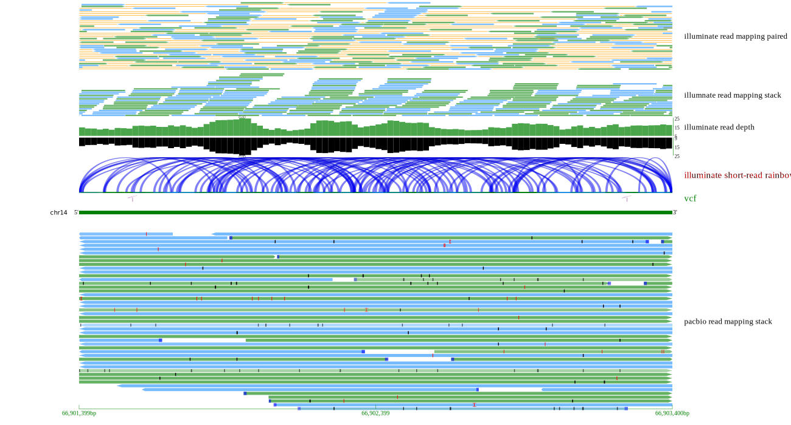
<br><br><br>
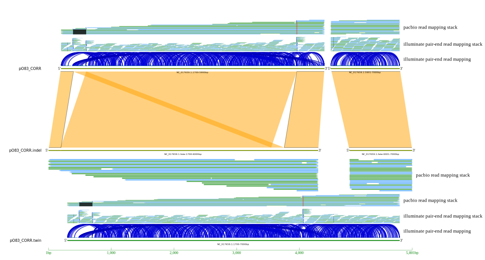
<br><br><br>
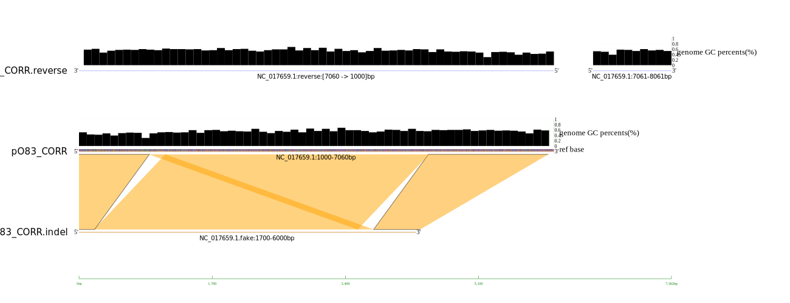
<br><br><br>
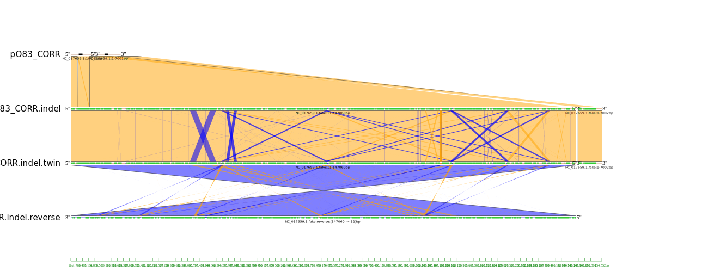
<br><br><br>
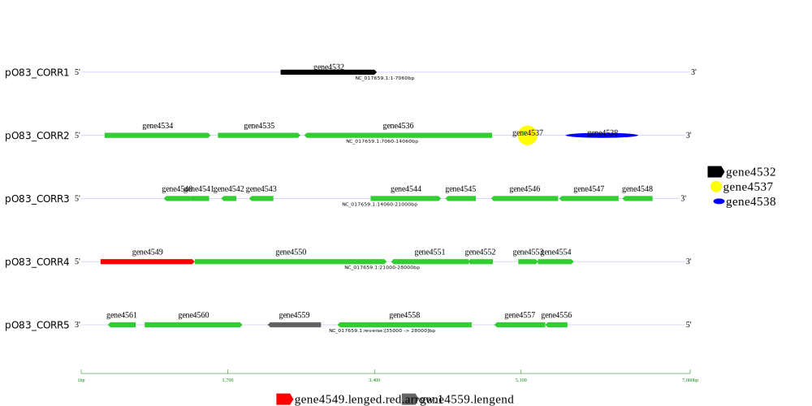
<br><br><br>
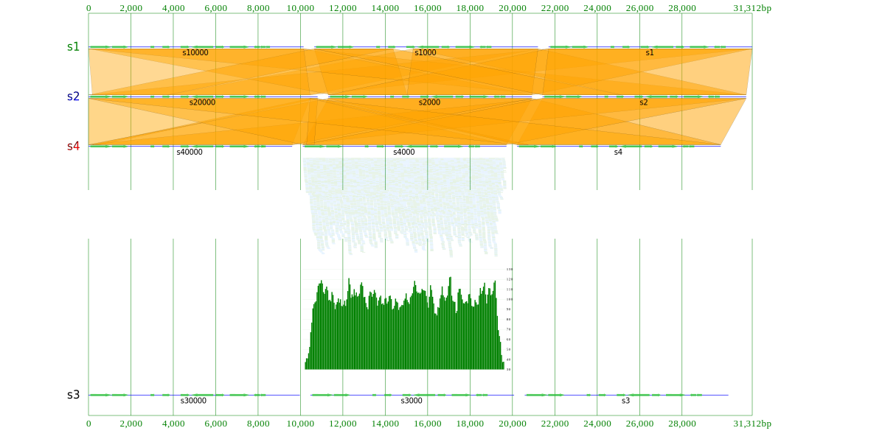
<br><br><br>

<br><br><br>
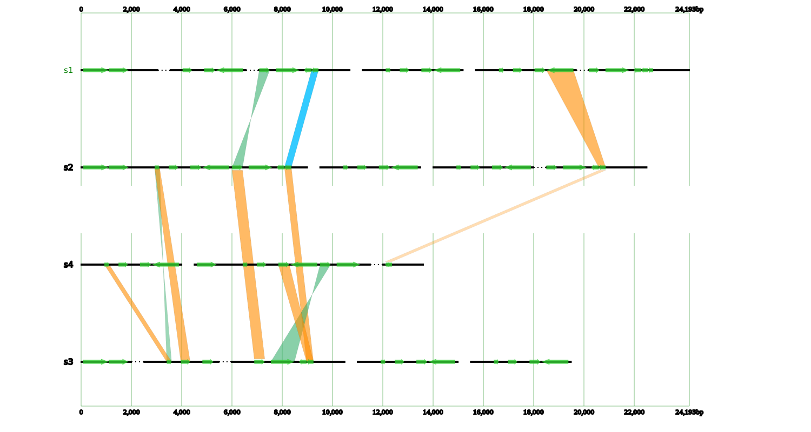
<br><br><br>
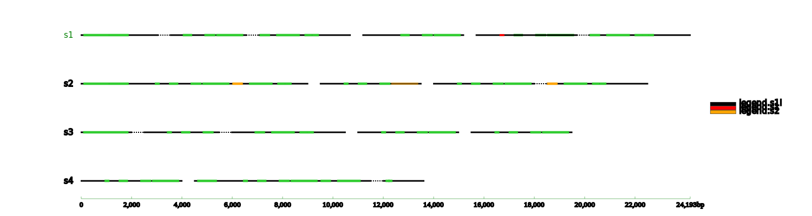
<br><br><br>
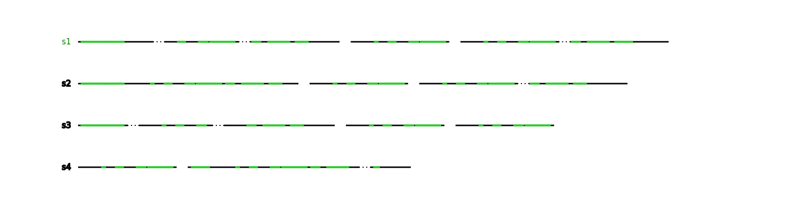
<br><br>
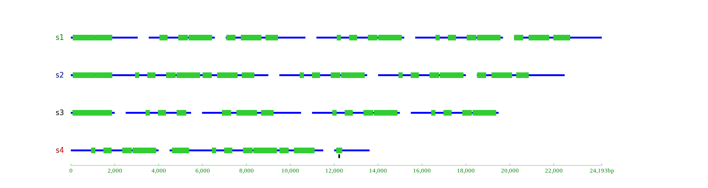
<br><br>
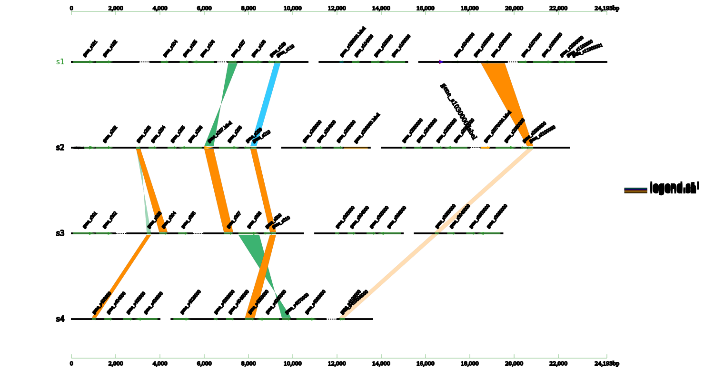
<br><br><br>


contact:<br>
&nbsp;&nbsp;&nbsp;&nbsp;QQ: 1522051171<br>
&nbsp;&nbsp;&nbsp;&nbsp;mail: ilikeorangeapple@gmail.com


## License
[](https://opensource.org/licenses/MIT)

